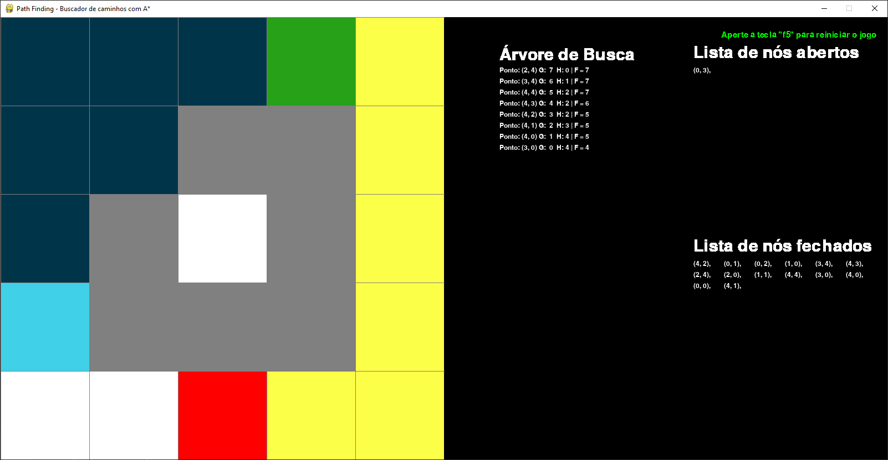

# A*(Star) Path Finding
 O algoritmo A* possui diversas aplicações, como por exemplo, a utilização para o planejamento de rotas que permite encontrar o caminho mais curto em um espaço de busca de rota através da função heurística.

 O problema a ser resolvido por este trabalho é encontrar a menor distância entre dois pontos fornecidos pelo usuário, tendo como objetivo simular visualmente cada uma das decisões tomadas em uma busca utilizando o algoritmo A*, ou seja, a lista de nós abertos e fechados a cada iteração, em conjunto com o caminho percorrido. Para isso, foi utilizada a linguagem de programação Python e a biblioteca Pygame, além de uma matriz quadrática MxM como estrutura de dados, representando o espaço de estados. 
 
 Adicionalmente, nossa implementação pode ser executada tanto com heurísticas admissíveis, como com heurísticas inadmissíveis (quando superestimam o custo real). Dessa forma, é possível comparar o desempenho do algoritmo utilizando as diferentes heurísticas. As heurísticas admissíveis escolhidas foram a distância de Manhattan e a distância de Chebyshev.
 
 A implementação também permite, além da escolha da heurística, escolher um ponto inicial, um ponto final e os obstáculos que podem ser distribuídos na matriz, permitindo simular diferentes caminhos.

## Exemplo de execução da aplicação:
   

## Como executar?
$ pip install -r requirements.txt

$ python3 main.py
